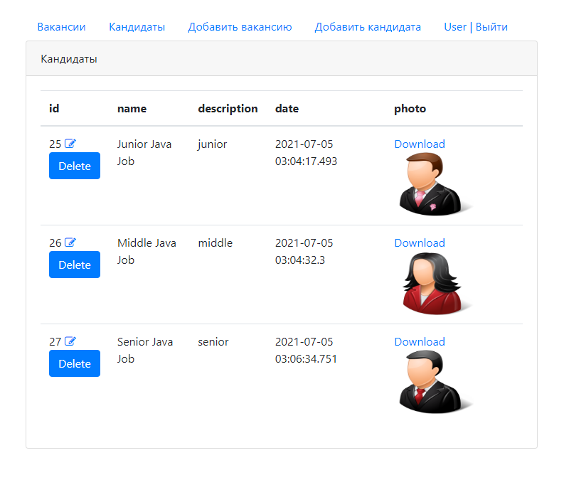
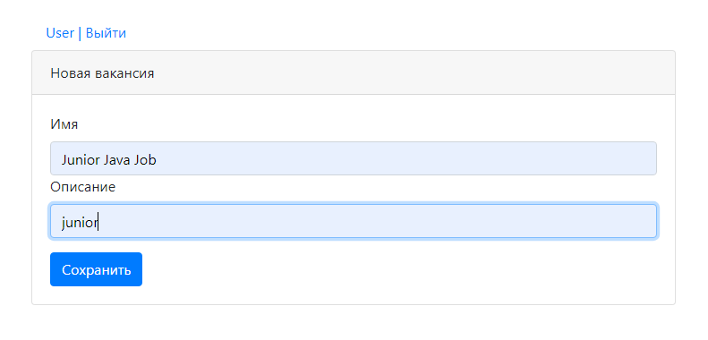
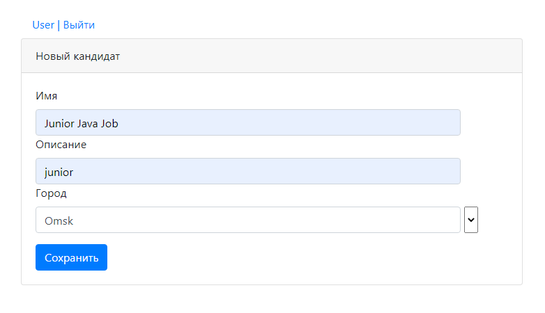
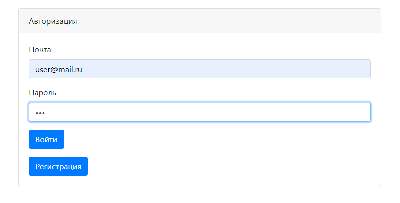

[](https://travis-ci.org/VadimShein/job4j_dreamjob)

## <p align="center">Биржа труда для поиска работы мечты</p>

## Описание:
В приложении публикуются вакансии работодателей и резюме кандидатов. Работодатель может добавить свою вакансию, а работник может добавить свое резюме.
После добавления возможно редактирование вакансии или резюме. 
Для работы с биржей труда необходимо создать учетную запись и авторизоваться.


## Используемые технологии:
* Java 13
* HTML, Bootstrap, CSS, JSP, JSTL
* JDBC, PosgreSQL
* JUnit, Mockito, Log4j
* Maven, Tomcat

## Скриншоты:
1. Список всех вакансий


2. Список всех кандидатов



3. Страница добавления новой вакансии. При наличии не заполненого поля выдается предупреждение.



4. Страница добавления нового кандидата. 
Выпадающий список содержит перечень городов, который пополняется введенными данными пользователей.



5. Страница регистрации и авторизации




## Запуск проекта:
1. Скопировать проект 
```
git clone https://github.com/VadimShein/job4j_dreamjob
```

2. Создать базу данных cars и таблицы из файла src/main/resources/db/schema.sql

3. Выполнить сборку проекта 
```
mvn clean package -DskipTests
```

4. Запустить приложение, адрес по умолчанию  [http://localhost:8080/dreamjob/index.jsp](http://localhost:8080/dreamjob/index.jsp)
Получившийся после сборки проекта файл dreamjob-1.0.war скопировать в каталог webapps Tomcat сервера. 
Выполнить настройку на веб-сервере для доступа к проекту через вебраузер.


## Контакты:
[](https://t.me/SheinVadim)
[](mailto:shein.v94@mail.ru)
