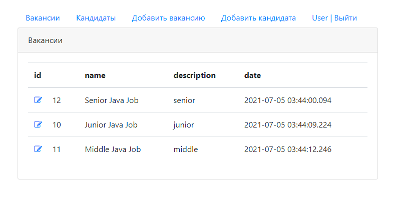

# 
DreamJob

## 
Labor exchange for finding a dream job

### Description:
The system publishes vacancies of employers and resume of employees.
The employer can add his vacancy, and the employee can add his resume.
After adding, it is possible to edit posts.
To work with the labor exchange, you must create an account and log in.

### Screenshots:

